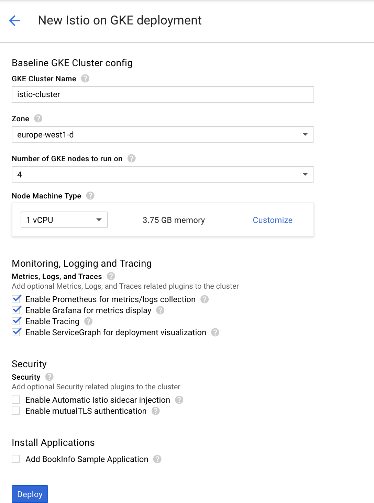

# Istio

## Module objectives

1. Configuring & installing Istio
1. Deploying a microservice with an istio sidecar
1. Monitoring and tracing
1. Route Rules and Virtual Services
1. Request Routing
1. Fault Injection
1. Traffic Mirroring
1. Circuit Breaking
1. Controlling ingress traffic [Using Istio Ingress]
1. Traffic Shifting
1. Rate-limiting using Istio & Memorystore [Redis]"

## Configure & Install Istio

1. Deploy Istio Kubernetes cluster using Google Cloud Marketplace

    Go to [Istio page](https://console.cloud.google.com/marketplace/config?templateurl=https:%2F%2Fraw.githubusercontent.com%2Fistio%2Fistio%2Frelease-1.0%2Finstall%2Fgcp%2Fdeployment_manager%2Fistio-cluster.jinja)

    

1. Wait until Deployment manager creates infrastructure for you.

1. Get credentials for the new cluster

    ```shell
    $ gcloud container clusters get-credentials istio-cluster
    Fetching cluster endpoint and auth data.
    kubeconfig entry generated for istio-cluster.
    ```

1. Make yourself admin of the cluster

    ```shell
    $ kubectl create clusterrolebinding cluster-admin-binding \
    --clusterrole cluster-admin \
    --user $(gcloud config get-value account)
    clusterrolebinding.rbac.authorization.k8s.io/cluster-admin-binding created
    ```

1. Verify Istio is isntalled and running

    ```shell
    $ kubectl get deployments,ing -n istio-system
    NAME                     DESIRED   CURRENT   UP-TO-DATE   AVAILABLE   AGE
    grafana                  1         1         1            1           4m21s
    istio-citadel            1         1         1            1           4m20s
    istio-egressgateway      1         1         1            1           4m21s
    istio-galley             1         1         1            0           4m21s
    istio-ingressgateway     1         1         1            1           4m21s
    istio-pilot              1         1         1            0           4m20s
    istio-policy             1         1         1            0           4m21s
    istio-sidecar-injector   1         1         1            0           4m20s
    istio-telemetry          1         1         1            0           4m20s
    istio-tracing            1         1         1            1           4m20s
    prometheus               1         1         1            1           4m20s
    servicegraph             1         1         1            1           4m20s
    ```

Now you are ready to deploy sample application to the Istio cluster.

## Deploying a microservice with an istio sidecar
