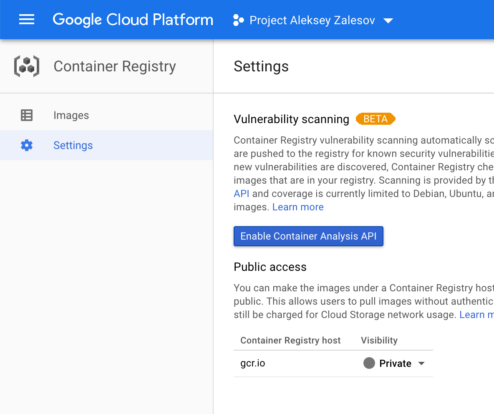
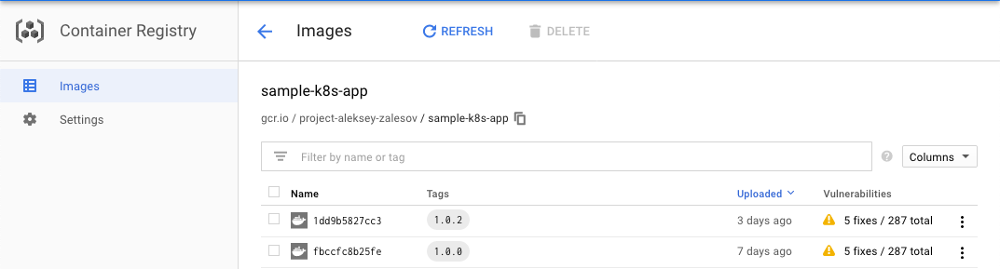

# Securing Container Images

## Module Objectives

1. Enable GCR Vulnerability Scanning
1. View and filter vulnerability occurrences
1. Redeploy the cluster with Binary Authorization enabled
1. Configure and test custom binary authorization policy"

## Enable GCR Vulnerability Scanning

Google container registry may scan images for known vulnerabilities. It will notify you by adding `Vulnerabilities` columen in the image build list. You may extend the support further by enabling Cloud Pub/Sub queue notifications to trigger automated response and Binary Authorisation to prevent insecure images from running on top of Kubernetes cluster.

1. From Google Web Console go to Container Registry -> Settings

1. In the Settings click `Enable Container Analysis API`

    

    Container registry scanning will be enabled automatically.

1. Now each image screen will show the vulnerabilities per build.

    

1. Click on the vulnerabilities column to show the list of vulnerabilities. Each has severity column which tells how dangerous is the bug, package column - the component of the image that has the bug and link to CVE describing it.

Scans currently work for Alpine, Ubuntu and Debian systems.
