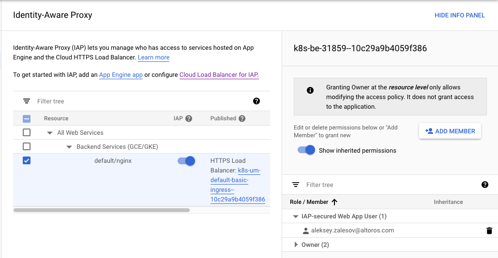
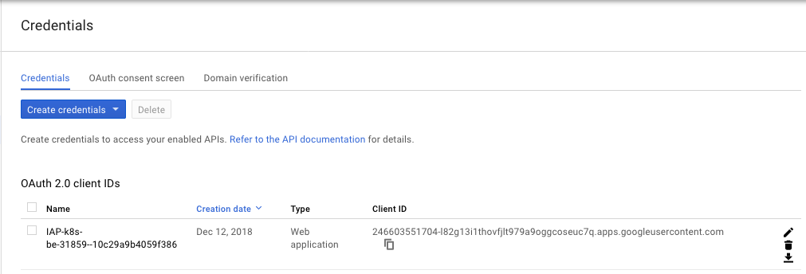

# Securing Network and Container Runtime

## Module Objectives

1. Create and test a network security policy
1. Create and test a pod security policy
1. Enable Istio mutual TLS
1. Use Istio Whitelist/Blacklist
1. Setup a GKE Private Cluster, make sure nodes don't have public IPs
1. Use Master Authorized Networks to secure access to the cluster master endpoint
1. Enable Metadata Concealment to prevent pods from accessing certain VM metadata
1. Enable and test Cloud IAP for the cluster

---

## Create and test a network security policy

First let's enable network policy enforcement on the GKE cluster.

It is a two-step process.

1. Deploy network policy addon on top of the cluster

    ```shell
    gcloud container clusters update gke-workshop \
      --update-addons=NetworkPolicy=ENABLED
    ```

    It will take about 6 minutes so be patient.

1. Enable network policy enforcement on the Nodes

    ```shell
    gcloud container clusters update gke-workshop \
      --enable-network-policy
    ```

    The rolling update takes 2 minutes per node so the cluster consisting of four nodes will be upgraded in 8 minutes.

1. Watch how your k8s cluster is updated one Node at a time:

    ```shell
    kubectl get nodes --watch
    ```

When all the nodes are in `Ready` state you may proceed to the next step.

Let's see how to use network policy for blocking the external traffic for a `Pod`

1. Create file called `deny-egress.yaml`:

    ```shell
    cat > deny-egress.yaml << EOM
    apiVersion: networking.k8s.io/v1
    kind: NetworkPolicy
    metadata:
      name: foo-deny-egress
    spec:
      podSelector:
        matchLabels:
          app: foo
      policyTypes:
      - Egress
      egress:
      # allow DNS resolution
      - ports:
        - port: 53
          protocol: UDP
        - port: 53
          protocol: TCP
    EOM
    ```

    ```shell
    kubectl apply -f deny-egress.yaml
    ```

    This network policy blocks all the outgoing traffic except DNS resolution.

1. Now start the pod that matches label `app=foo`

    ```shell
    $ kubectl run --rm --restart=Never --image=alpine -i -t --labels app=foo test -- ash

    $ nslookup www.example.com
    nslookup: can't resolve '(null)': Name does not resolve

    Name:      www.example.com
    Address 1: 93.184.216.34
    Address 2: 2606:2800:220:1:248:1893:25c8:1946

    $ wget --timeout 1 -O- http://www.example.com
    Connecting to www.example.com (93.184.216.34:80)
    wget: download timed out
    ```

    You see the name resolution works fine but external connections are dropped.

    `nslookup: can't resolve '(null)': Name does not resolve` is a [bug](https://forums.docker.com/t/resolved-service-name-resolution-broken-on-alpine-and-docker-1-11-1-cs1/19307/11), ignore it for now

## Create and test a pod security policy

To enable PSP for the new cluster, use `--enable-pod-security-policy` flag while creating

We have already created the cluster so we will use the update command.

1. Update the cluster to enable PSP

    ```shell
    gcloud beta container clusters update gke-workshop-0 \
      --enable-pod-security-policy
    ```

    Note that you must use `beta` version of `gcloud` to execute this command.

    It will take about 6 minutes for updating the cluster during which you won't be able to access API.

1. Start from the psp boilerplate and add security measures to disable priviledge escalation to root

    ```yaml
    apiVersion: policy/v1beta1
    kind: PodSecurityPolicy
    metadata:
      name: restricted
    spec:
      privileged: false
      allowPrivilegeEscalation: false
      seLinux:
        rule: 'RunAsAny'
      runAsUser:
        rule: 'MustRunAsNonRoot'
      supplementalGroups:
        rule: 'MustRunAs'
        ranges:
          - min: 1
            max: 65535
      fsGroup:
        rule: 'MustRunAs'
        ranges:
          - min: 1
            max: 65535
    ```

    ```shell
    kubectl apply -f psp.yaml
    ```

1. Typically `Pods` are created by `Deployments`, `ReplicaSets`, not by the user directly. These controllers act on behalf of the default service account. We need to grant permissions for using this policy to the default account.

    ```yaml
    kind: ClusterRole
    apiVersion: rbac.authorization.k8s.io/v1
    metadata:
      name: pod-starter
    rules:
    - apiGroups:
      - extensions
      resources:
      - podsecuritypolicies
      resourceNames:
      - restricted
      verbs:
      - use
    EOM
    ```

    ```shell
    kubectl apply -f pod-starter-role.yaml
    ```

1. Bind the role to the `default` service account

    ```yaml
    apiVersion: rbac.authorization.k8s.io/v1beta1
    kind: RoleBinding
    metadata:
      name: pod-starter-binding
      namespace: default
    roleRef:
      apiGroup: rbac.authorization.k8s.io
      kind: ClusterRole
      name: pod-starter
    subjects:
    - kind: ServiceAccount
      name: default
      namespace: default
    ```

    ```shell
    kubectl apply -f psp-binding.yaml
    ```

1. Now try to create a priviledged container

    ```shell
    kubectl create -f- <<EOF
    apiVersion: apps/v1
    kind: Deployment
    metadata:
      name: nginx-privileged
      labels:
        app: privileged
    spec:
      replicas: 1
      selector:
        matchLabels:
          app: privileged
      template:
        metadata:
          labels:
            app: privileged
        spec:
          containers:
            - name:  nginx
              image: nginx
              securityContext:
                privileged: true
    EOF
    ```

    `Deployment` creates `ReplicaSet` that in turn creates `Pod`. Let' see the `ReplicaSet` state.

1. Show the `ReplicaSet` state

    ```shell
    $ kubectl get rs -l=app=privileged
    NAME                    DESIRED   CURRENT   READY     AGE
    privileged-6c96db7488   1         0         0         5m
    ```

    No pods created. Why?

1. Get events from the `ReplicaSet`

    ```shell
    $ kubectl describe rs -l=app=privileged
    ..
    Error creating: pods "privileged-6c96db7488-" is forbidden: unable to validate against any pod security policy: [spec.containers[0].securityContext.privileged: Invalid value: true: Privileged containers are not allowed]
    ```

    Admission controller forbids creating priviledged container as the applied policy states.

1. What happens if you create pod directly?

    ```shell
    kubectl create -f- <<EOF
    apiVersion: v1
    kind: Pod
    metadata:
      name: nginx-privileged
    spec:
      containers:
        - name:  nginx
          image: nginx
          securityContext:
            privileged: true
    EOF
    ```

    Can you explain the result?

## Setup a GKE Private Cluster

GKE cluster endpoints by default have public IPs. That mean users outside may access both master API and SSH to the nodes.

GKE private cluster is a method to deploy cluster with private IPs only and restrict outside access.  The method uses VPC peering to connect master with nodes. Nodes have no Internet access. To access GCP service like Container Registry they use Private Google Access.

To interact with the cluster one need to provision a vm inside the cluster network or setup master authorized networks.

1. Create a private kubernetes cluster on GKE

    ```shell
    gcloud container clusters create gke-workshop-1 \
        --create-subnetwork name=workshop-subnet \
        --enable-master-authorized-networks \
        --enable-ip-alias \
        --enable-private-nodes \
        --enable-private-endpoint \
        --master-ipv4-cidr 172.16.0.32/28 \
        --no-enable-basic-auth \
        --no-issue-client-certificate \
        --cluster-version 1.11.3 \
        --num-nodes 1 \
        --machine-type n1-standard-2
    ```

    `--enable-private-nodes` configures Nodes to use internal IP addresses

    `--enable-private-endpoint` disables public master API endpoint

    `--enable-ip-alias` is required to enable VPC peering between master and nodes

    `--enable-master-authorized-networks` configure cluster to allow connections from other subnets then one the cluster itself uses

1. Try to connect to the clsuter from your laptop.

    `kubectl` hangs as private endpoint is not available over the internet

1. Create jumpbox in the same subnet as Kuberentes cluster

    ```shell
    # create jumpbox instance in the same subnet
    gcloud compute instances create jumpbox-inner \
      --subnet=workshop-subnet \
      --machine-type=f1-micro \
      --scopes=cloud-platform

    gcloud compute ssh jumpbox-inner
    ```

    `--scopes=cloud-platform` option allows `gcloud` SDK download cluster credentials from within the instance

    `--subnet=workshop-subnet` creates machine is the same subnet as cluster

    Jumpbox has both public and private IPs. You SSH to the jumpbox with its public interface and connect to the Kubernetes cluster using private IP.

1. Verify that you can access Kubernetes from the jumpbox

    ```shell
    $ gcloud container clusters get-credentials gke-workshop-1 --zone=europe-west1-d
    Fetching cluster endpoint and auth data.
    kubeconfig entry generated for gke-workshop-1.

    $ sudo apt-get update && sudo apt-get install kubectl

    $ kubectl get nodes -o wide
    NAME                                            STATUS   ROLES    AGE   VERSION          INTERNAL-IP   EXTERNAL-IP
      OS-IMAGE                             KERNEL-VERSION   CONTAINER-RUNTIME
    gke-gke-workshop-1-default-pool-f80a37f2-wxfj   Ready    <none>   16m   v1.11.3-gke.18   10.70.0.2 Container-Optimized OS from Google   4.14.65+         docker://17.3.2

    $ kubectl cluster-info
    Kubernetes master is running at https://172.16.0.34
    GLBCDefaultBackend is running at https://172.16.0.34/api/v1/namespaces/kube-system/services/default-http-backend:ht
    tp/proxy
    Heapster is running at https://172.16.0.34/api/v1/namespaces/kube-system/services/heapster/proxy
    KubeDNS is running at https://172.16.0.34/api/v1/namespaces/kube-system/services/kube-dns:dns/proxy
    Metrics-server is running at https://172.16.0.34/api/v1/namespaces/kube-system/services/https:metrics-server:/proxy
    ```

1. Now create the vm outside the cluster subnet

    ```shell
    $ gcloud compute instances create jumpbox-outer \
      --machine-type=f1-micro \
      --scopes=cloud-platform
    Created [https://www.googleapis.com/compute/v1/projects/project-aleksey-zalesov/zones/europe-west1-d/instances/jumpbox-outer].
    NAME           ZONE            MACHINE_TYPE  PREEMPTIBLE  INTERNAL_IP  EXTERNAL_IP    STATUS
    jumpbox-outer  europe-west1-d  f1-micro                   10.132.0.2   35.205.132.74  RUNNING

    $ gcloud compute ssh jumpbox-outer
    ```

1. Can you connect to the Kubernetes cluster from `jumpbox-outer`? Try it.

1. To enable connections from the vm outside cluster subnet add the machines private IP address to the list of masters authorized networks.

    ```shell
    gcloud container clusters update gke-workshop-1 \
        --enable-master-authorized-networks \
        --master-authorized-networks 10.132.0.2/32
    ```

    This time you should be able to access Kubernetes API from `jumpbox-outer`

### Clean up: private cluster

Delete the provisioned resources

```shell
gcloud compute instances delete jumpbox-inner jumpbox-outer

gcloud container clusters delete gke-workshop-1
```

## Enable Metadata Concealment to prevent pods from accessing certain VM metadata

Nodes running in Google Cloud may learn information about themselves by querying metadata server. It is accessible without authentication from any instance on the host `http://metadata/computeMetadata/v1/`.

Some metadata is considered sensitive, in particular instance identity token. Applications connecting to the instance may verify the instance identity with this token. Pod may interact as instance if it gets access to the token and recieves the connection from an app.

First let's try to get the token from the unrestricted cluster.

```shell
$ kubectl run --rm --restart=Never --image=alpine -i -t test -- ash

$ apk add curl

$ curl -H "Metadata-Flavor: Google" 'http://metadata/computeMetadata/v1/instance/service-accounts/default/identity?audience=https://www.example.com'
eyJhbGciOi...
```

One can get instance identity token from the `Pod`.

Let's disable this behavior.

```shell
gcloud beta container clusters create gke-workshop-0 \
--cluster-version 1.11.3 \
--num-nodes 1 \
--machine-type n1-standard-1 \
--workload-metadata-from-node=SECURE
```

Run a container with the shell inside the cluster.

```shell
$ kubectl run --rm --restart=Never --image=alpine -i -t test -- ash

$ apk add curl

$ curl -H "Metadata-Flavor: Google" 'http://metadata/computeMetadata/v1/instance/service-accounts/default/identity?audience=https://www.example.com'
This metadata endpoint is concealed.
```

GKE runs proxy between Pods and Metadata server. This proxy conceals identity token endpoint and `kube-env`.

What if user wants to get project id where the Kubernetes is running?

```shell
$ curl -H "Metadata-Flavor: Google" 'http://metadata/computeMetadata/v1/project/project-id'
project-aleksey-zalesov/
```

It works as proxy does not conceal all the endpoints.

In current configuration one may use legacy endpoint `v1beta1` instead of `v1`. The `v1beta1` is considered less secure as it does not implement some safeguards. For example, it does not require "Metadata-Flavor: Google" header which protects user from quering the endpoint by accident from the insecure environment.

```shell
$ curl 'http://metadata/computeMetadata/v1beta1/project/project-id'
project-aleksey-zalesov/
```

Unfortunately, one may not disable legacy endpoints for the existing cluster. So you need to rebuild cluster.

```shell
gcloud beta container clusters create gke-workshop-1 \
--cluster-version 1.11.3 \
--num-nodes 1 \
--machine-type n1-standard-1 \
--workload-metadata-from-node=SECURE \
--metadata disable-legacy-endpoints=true
```

After the cluster is ready and you run a shell inside of it, try to use `v1beta` endpoint.

```shell
$ curl 'http://metadata/computeMetadata/v1beta1/project/project-id'

Your client does not have permission to get URL <code>/computeMetadata/v1beta1/project/project-id</code> from this server. Legacy metadata endpoint accessed: /computeMetadata/v1beta1/project/project-id
Legacy metadata endpoints are disabled. Please use the /v1/ endpoint.
```

Metadata concealment is a temporary security solution made available to users of GKE while the bootstrapping process for cluster nodes is being redesigned with significant security improvements. This feature is scheduled to be deprecated and removed in the future.

### Clean up: metadata conceal

Get rid of both clusters.

```shell
gcloud container clusters delete gke-workshop-0 --async
gcloud container clusters delete gke-workshop-1 --async
```

## Cloud IAP

1. Make sure that you have `sample-app` exposed as Ingress

    ```shell
    $ kubectl get ingress
    NAME            HOSTS   ADDRESS          PORTS     AGE
    basic-ingress   *       35.244.247.163   80, 443   34m
    ```

    Note external IP of the ingress - `35.244.247.163`

1. Cloud IAP requires that users connect using HTTPS protocol. So now you will generate self-signed TLS certificate and add it to the Ingress.

    Generate self-signed certificate

    ```shell
    openssl req \
      -x509 -nodes -days 365 -newkey rsa:2048 \
      -keyout tls.key \
      -out tls.crt \
      -subj "/CN=35.244.247.163.xip.io/O=nginxsvc"
    ```

    Note that we use xip.io domain as Cloud IAP doesn't allow using IP.

    Create a secret with tls certificate and private key

    ```shell
    kubectl create secret tls tls-secret-0 --key tls.key --cert tls.crt
    ```

    Add the secret to the ingress

    ```yaml
    apiVersion: extensions/v1beta1
    kind: Ingress
    metadata:
      name: basic-ingress
    spec:
      tls:
      - secretName: tls-secret-0
    ..
    ```

    Apply the configuration.

    Proceed to the next step when the application is available using HTTPS.

1. Now add conscent screen to the project. This information will be displayed for the users accessing the application.

    - URL: https://console.cloud.google.com/apis/credentials/consent
    - Application type: Internal
    - Application name: sample app
    - Authorized domains: xip.io
    - Application Homepage link: http://35.244.247.163.xip.io/home
    - Application Privacy Policy link: http://35.244.247.163.xip.io/privacy
    - Application Terms of Service link: http://35.244.247.163.xip.io/tos

    Click save.

1. Add yourself as user who can access the application

    Go to https://console.cloud.google.com/security/iap

    Select the ingress for the sample application.

    In the right pane click "Add member" and add yourslef with the role `IAP-secured Web App User`.

    Note that you can't add users outside `altoros.com` organisation as the application marked as `Internal`.

    

1. Click the slider in the center of the screen to tur IAP on

1. Wait until Cloud IAP provisions credentails

    They will be available at https://console.cloud.google.com/apis/credentials

    

1. When available export as environmental vaiables Client ID and Client secret.

    ```shell
    export CLIENT_ID="24..9oggcoseuc7q.apps.googleusercontent.com"
    export CLIENT_SECRET="NOTD.."
    ```

1. Create a secret with OAuth data

    ```shell
    kubectl create secret generic my-secret-0 \
      --from-literal=client_id=$CLIENT_ID \
      --from-literal=client_secret=$CLIENT_SECRET
    ```

1. And use this secret as the backend configuration for Cloud IAP

    ```yaml
    apiVersion: cloud.google.com/v1beta1
    kind: BackendConfig
    metadata:
      name: config-default
      namespace: default
    spec:
      iap:
        enabled: true
        oauthclientCredentials:
          secretName: my-secret-0
    ```

1. Now wait some time and go to https://35.244.247.163.xip.io/

    The IP will be different in your case.

    You should see the screen `Sign in with Google`

    Enter the account and the password you for the training and you will see the application frontend.

    Try to login with a different user and make sure you can't access the application.

In this exercise you configured Cloud IAP to protect the application running on GKE.